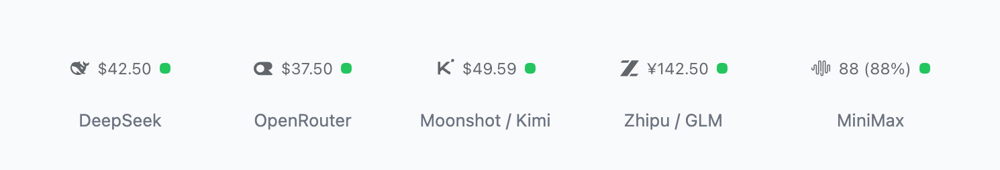
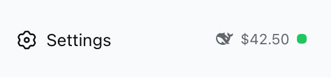
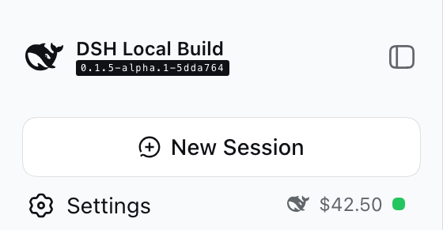
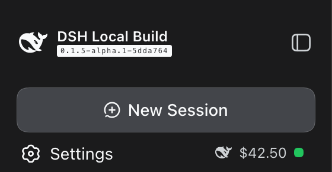

# dsh-balance

[](https://www.npmjs.com/package/@andregoncalves/dsh-balance)
[](LICENSE)
[](https://nodejs.org)
[](https://github.com/deepseek-ai/deepseek-harness)

**English** | [中文](README.zh.md)

A [DeepSeek Harness](https://github.com/deepseek-ai/deepseek-harness) plugin that puts the **account balance of the provider serving your active model** in the sidebar foot — right-aligned next to the Settings button — and keeps it fresh.

The chip is **provider-aware**: it reads the active session's selected model and shows the matching provider's balance, flipping automatically when you switch models.

On DeepSeek the chip also tracks **peak / off-peak billing** — the status dot turns red inside DeepSeek's peak window and green off-peak, when requests cost half price. See [DeepSeek peak / off-peak hours](#deepseek-peak--off-peak-hours).

<p align="center">
  
</p>

## Contents

- [Why dsh-balance?](#why-dsh-balance)
- [Lightweight by design](#lightweight-by-design)
- [Highlights](#highlights)
- [Screenshots](#screenshots)
- [Supported providers](#supported-providers)
  - [DeepSeek peak / off-peak hours](#deepseek-peak--off-peak-hours)
- [Install](#install)
- [Configuration](#configuration)
- [Preview without an account (mock mode)](#preview-without-an-account-mock-mode)
- [How it works](#how-it-works)
- [Development](#development)
- [Troubleshooting](#troubleshooting)
- [FAQ](#faq)
- [License](#license)

## Why dsh-balance?

- **Provider-aware, not DeepSeek-only.** It follows the **active model's provider** across DeepSeek, OpenRouter, Moonshot/Kimi, Zhipu/GLM, and MiniMax — the chip changes the moment you switch models.
- **The smallest thing that does the job.** No settings panel, no cost projection, no extra services. One route, one chip, ~11 kB gzipped.
- **Zero core interference.** An out-of-tree package that registers into a declared slot. Nothing in the Harness source is patched or forked.

## Lightweight by design

`dsh-balance` is deliberately minimal, and it adds no machinery to the Harness:

| | |
|---|---|
| **Runtime dependencies** | **none** — `dependencies: {}`; the only imports are `@deepseek-ai/*` platform modules and React, all supplied by the running Harness as optional peers |
| **Bundle size** | host half **~8 kB** (3.1 kB gzip) + browser half **~23 kB** (8.1 kB gzip) → **~11 kB gzip combined** |
| **Harness surface** | **one** exact route (`GET /plugins/balance`) and **one** component in the declared `sidebar.footer.action` slot |
| **Core patches** | **none** — no forked files and no core CSS patch; the plugin styles only its own footer row from its own DOM anchor |
| **Background work** | none — no database, no worker, no telemetry, no global state; a single `setInterval` per chip, cleared on unmount |
| **Lifecycle** | the route is registered through `ctx.effect`, so it unwinds on unload; model-directory subscriptions unsubscribe; removing the plugin leaves nothing behind |
| **Failure isolation** | a missing key or an upstream error degrades to a muted pill — it never blocks a session or the UI |

> **Nothing to configure, nothing to tear down.** Install it and the only change is one row in the sidebar foot. Uninstall it and the Harness is exactly as it was.

## Highlights

- **One chip, five providers.** DeepSeek, OpenRouter, Moonshot/Kimi, Zhipu/GLM (Z.ai), and MiniMax — each with its own brand mark, currency, and tooltip breakdown.
- **Provider-aware.** Switching the active model switches the chip to that provider's balance immediately.
- **Peak/off-peak aware on DeepSeek.** The status dot turns red during DeepSeek's peak billing window (Monday–Friday, Beijing 09:00–12:00 and 14:00–18:00) and green off-peak, when requests cost half price.
- **Your key never reaches the browser.** The host half resolves the credential and calls the provider; the browser only ever sees a normalized balance.
- **Live.** Auto-refreshes every 60 seconds, on click, when the session changes, and the moment the model's provider changes.
- **Graceful.** A missing key or an upstream error becomes a muted `Balance —` pill with the reason in the tooltip — never a broken layout.
- **Preview without an account.** A built-in mock mode renders real-looking balances for any provider.

## Screenshots

<p>
  
</p>

<hr>

<table>
  <tr>
    <td align="center"></td>
    <td align="center"></td>
  </tr>
  <tr>
    <td align="center"><sub>Light theme</sub></td>
    <td align="center"><sub>Dark theme</sub></td>
  </tr>
</table>


## Supported providers

| Active model route | Balance shown | Source |
|---|---|---|
| `deepseek`, `deepseek-official` | DeepSeek account balance (native currency) | `api.deepseek.com/user/balance` |
| `openrouter` | Remaining credits (`total_credits − total_usage`, USD) | `openrouter.ai/api/v1/credits` |
| `moonshotai`, `moonshotai-cn` | Available balance (USD, cash + voucher) | `api.moonshot.ai` / `api.moonshot.cn` `/v1/users/me/balance` |
| `zai`, `zai-coding-cn`, `zhipu` | Account balance (CNY by default) | `open.bigmodel.cn` / `api.z.ai` account report |
| `minimax`, `minimax-cn` | Token-plan remaining quota (count or %) | `minimax.io` / `api.minimaxi.com` `/v1/token_plan/remains` |
| anything else | DeepSeek balance | same as the `deepseek` row |

The mapping is deliberately narrow: a route the plugin does not recognize (including a custom provider id) falls back to the DeepSeek balance rather than failing the chip.

### What the chip shows

- **`[brand mark] $9.74 ●`** — the provider's logo, the amount, then a status dot.
- **Status dot** — DeepSeek marks its peak/off-peak billing window (green = off-peak, red = peak; see [DeepSeek peak / off-peak hours](#deepseek-peak--off-peak-hours)). OpenRouter, Moonshot, Zhipu, and MiniMax mark a positive remaining balance or quota (green = left, red = exhausted).
- **Tooltip** — the full breakdown (for example `Total $42.50 · Granted $5.00 · Topped up $37.50`).
- **Click** — refresh now.
- **Errors** — a muted `Balance —` pill; hover for the reason, click to retry.
- The collapsed 56px sidebar rail hides the chip — there is no room beside the gear.

### DeepSeek peak / off-peak hours

DeepSeek bills **off-peak requests at half the peak price**. The chip's status dot reflects the current window, evaluated in UTC so it is correct regardless of your machine's timezone:

| Window | When |
|---|---|
| **Peak** — red dot | **Monday–Friday**, Beijing time (UTC+8) **09:00–12:00** and **14:00–18:00** — i.e. **01:00–04:00** and **06:00–10:00 UTC** |
| **Off-peak** — green dot | Every other hour, **including the whole weekend**, at 50% of the peak price |

Source: [DeepSeek API — Models & Pricing](https://api-docs.deepseek.com/quick_start/pricing), footnote (1): *"Off-peak prices are half of the peak prices. Peak hours are Beijing time Monday to Friday 9:00–12:00 and 14:00–18:00 (all other times are off-peak)."*

**DeepSeek is the only one of the five with a recurring peak/off-peak schedule.** The other providers have no time-of-day pricing windows, so their dot reflects balance/quota rather than a pricing window:

| Provider | Time-of-day pricing? | What it uses instead |
|---|---|---|
| DeepSeek | **Yes** — Mon–Fri peak, off-peak at half price | — |
| OpenRouter | No | Provider pass-through prices plus a platform fee |
| Moonshot / Kimi | No | Flat token prices with cache discounts |
| Zhipu / GLM (Z.ai) | No | List prices with occasional limited-time promotions |
| MiniMax | No | Flat token prices (a permanent 50% off M3) plus an optional 1.5× priority tier |

## Install

Requirements: a DeepSeek Harness install with the web profile (`dsh web`) and Node.js ≥ 22.18.

> The plugin is self-contained: it needs no extra services, no configuration file, and no core patch. Installation adds one dependency and one sidebar row.

### From npm

```sh
pnpm dsh plugin --profile web add @andregoncalves/dsh-balance
```

### From GitHub

```sh
pnpm dsh plugin --profile web add github:andregoncalves/dsh-balance
```

The package builds itself on install (`prepare` → `pnpm run build`), so `lib/` does not need to be committed.

### From a local clone (development)

```sh
git clone https://github.com/andregoncalves/dsh-balance.git
cd dsh-balance
pnpm install
pnpm run build
pnpm dsh plugin --profile web add link:"$PWD"
```

Use `link:` rather than `file:`: a plain `file:` dependency is hardlinked and breaks on atomic rebuilds.

### How the row is wired

The package declares **`dsh.bundle`**, so `dsh plugin add` appends it to your profile's `dsh.profile.bundles` and the bundle's own `cordis.patch.yml` inserts the sidebar row — **no manual patch editing**. Refresh the browser once after the first install so the boot manifest (`window.__DSH_BOOT__`) picks up the new row; after that, source changes rebuild and hot-swap live.

<details>
<summary>Managing the profile by hand (or an older <code>dsh</code> that ignores <code>dsh.bundle</code>)</summary>

Add the bundle to `~/.dsh/profiles/web/package.json`:

```json
"dsh": { "profile": { "bundles": ["@deepseek-ai/dsh-base", "@deepseek-ai/dsh-web-app", "@andregoncalves/dsh-balance"] } }
```

The bundle's patch then inserts the row. If you prefer a plain dependency instead, drop the `dsh.bundle` handling and add the row yourself to `~/.dsh/profiles/web/cordis.patch.yml`:

```yaml
- insert:
    - id: dsh-balance
      name: "@andregoncalves/dsh-balance"
```

Either way the `id` is the plugin's internal Cordis name and stays `dsh-balance`; the `name` is the installed package.

</details>

### Verify

```sh
curl http://127.0.0.1:3080/plugins/balance                    # DeepSeek
curl "http://127.0.0.1:3080/plugins/balance?kind=openrouter"  # OpenRouter
curl "http://127.0.0.1:3080/plugins/balance?kind=moonshot"    # Moonshot / Kimi
curl "http://127.0.0.1:3080/plugins/balance?kind=zhipu"       # Zhipu / GLM
curl "http://127.0.0.1:3080/plugins/balance?kind=minimax"     # MiniMax
```

Each returns `{"ok":true,"provider":"…","balance":{…}}`, or `{"ok":false,"error":"no-key","message":"…"}` when the credential is missing.

## Configuration

DeepSeek resolves `DEEPSEEK_API_KEY` through the Harness **credentials seam** (for example `~/.dsh/.credentials.yaml`). The other providers try the seam first, then fall back to the ambient launch environment (process, the invoking project's `.env`, then the Harness home's `.env`).

| Provider | Credential names tried, in order |
|---|---|
| DeepSeek | `DEEPSEEK_API_KEY` |
| OpenRouter | `OPENROUTER_API_KEY` |
| Moonshot / Kimi | `MOONSHOT_API_KEY` |
| Zhipu / GLM | `ZAI_API_KEY`, `GLM_API_KEY`, `ZHIPU_API_KEY` |
| MiniMax | `MINIMAX_API_KEY`, `MINIMAX_CN_API_KEY`, `MINIMAX_API_TOKEN` |

To share one credential plane with the model adapter, store the key in `~/.dsh/.credentials.yaml` and add `apiKeyEnv` to the route. Zhipu's account endpoints expect the key verbatim (no `Bearer` prefix); the host applies the right scheme automatically. Moonshot and Zhipu mirror across two regional hosts, so a key valid on only one site falls through to the other before the request is reported as failed.

## Preview without an account (mock mode)

Mock mode serves canned balances from the host and skips credential resolution and the upstream call. It is off by default and enabled with `DSH_BALANCE_MOCK=1` or a `?mock=1` query parameter.

```sh
curl "http://127.0.0.1:3080/plugins/balance?kind=moonshot&mock=1"
curl "http://127.0.0.1:3080/plugins/balance?kind=zhipu&mock=1"
curl "http://127.0.0.1:3080/plugins/balance?kind=minimax&mock=1"
```

To see it in the GUI, start the server with the environment variable:

```sh
DSH_BALANCE_MOCK=1 dsh web
```

Then add a route in **Settings → Models** for the provider you want to preview (`moonshotai`, `zai`, `minimax`, …), add a model, and select it. The chip follows the active model and shows the canned balance with no real key. Mock mode never reads a credential and never contacts a provider — its numbers are for layout preview only.

## How it works

`dsh-balance` is a **dual-face Cordis package**: one npm package with a host half and a browser half.

| Part | File | Job |
|---|---|---|
| Bundle layer | `cordis.patch.yml` | Declared by `dsh.bundle`; inserts the `dsh-balance` row when a profile lists the package, so `dsh plugin add` needs no manual patch editing. |
| Host (Node) | `src/index.ts` | Registers `GET /plugins/balance?kind=…` on the host web server. Resolves the key through the credentials seam (and the launch environment for the added providers), calls the provider, and relays a normalized balance. **The key never crosses the wire to the browser.** |
| Browser | `src/client/index.tsx` | Registers the `BalanceChip` component into the `sidebar.footer.action` slot. Reads the active session's model provider through the session API, maps it to a `kind`, and polls the host route every 60s, on click, on session change, and on model switch. Each provider's payload is shaped by its own renderer. |

The browser bundle is served by the host's client-module pipeline in the `window.__ModuleLoader__.load({ id, factory })` closure format the web shell consumes; `react` and the `@deepseek-ai/*` platform modules stay external and resolve from the browser's frozen module table.

> **Forking note.** The client-module entry id is the **npm package name**. The build reads it from `package.json` (`tsdown.config.ts`), and `scripts/verify-client.mjs` asserts the same value. If you rename the package, update the `name` in `cordis.patch.yml` and the entry in the profile's `dsh.profile.bundles` too — the plugin's internal Cordis `name` export stays `dsh-balance`.

## Development

```sh
pnpm install
pnpm run build     # tsdown: lib/index.js (host) + lib/client.js (browser)
pnpm run verify    # evaluates the client bundle against a stubbed module table
```

With a `link:` install, rebuilding `lib/` updates the running app immediately, including a live hot-swap of the chip in an open browser tab. Host-side changes may need a reload or restart depending on your DSH workflow.

The `@deepseek-ai/*` platform packages are **optional peer dependencies** supplied by the running Harness, so they are never fetched during `pnpm install` (see `pnpm-workspace.yaml`). TypeScript type-checking therefore requires a Harness checkout on your `tsconfig` paths; the build itself has no such requirement.

## Troubleshooting

| Symptom | Cause and fix |
|---|---|
| `Balance —` with `Set DEEPSEEK_API_KEY …` | The credential is not resolvable. Store it in `~/.dsh/.credentials.yaml` or the launch environment. |
| Chip shows the DeepSeek balance on another provider | The route id is not in the mapping above — open an issue with the route id. |
| Chip missing after renaming the package | The client-module id is the package name; make sure the `cordis.patch.yml` row and the `dsh.profile.bundles` entry match `package.json`, then restart `dsh web`. |
| Chip missing in the collapsed rail | Expected — the 56px rail has no room beside the gear. |
| Upstream `401`/`403` on Moonshot or Zhipu | The key belongs to the other regional host; the plugin already tries the mirror, so a persistent error means the key is invalid on both. |

## FAQ

**Does the browser ever see my API key?** No. The host half resolves the credential through the Harness credentials seam and calls the provider; the browser only receives a normalized balance.

**Will it break the Harness if I remove it?** No. It registers one route and one slot component, both owned by the plugin. Uninstall it and the Harness is exactly as it was — nothing in the core is modified.

**What does it cost to run?** One small local HTTP request per minute per open tab, and only while the sidebar is wide. Mock mode makes no provider requests at all.

**Why does a custom provider show the DeepSeek balance?** Unknown routes deliberately fall back to DeepSeek instead of failing the chip. Open an issue with the route id and it can be added.

**Does it work with a headless/CLI session?** The chip is a web-sidebar feature; the host route works in any profile that mounts the web server, but there is no chip to render without the web UI.

## License

[MIT](LICENSE) © 2026 Andre Goncalves
